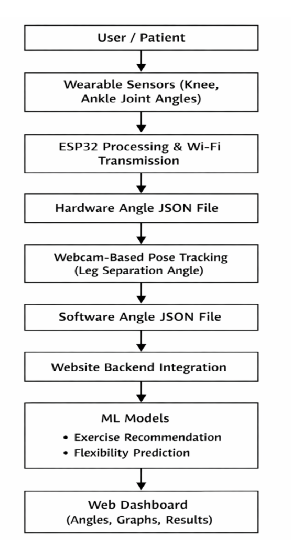
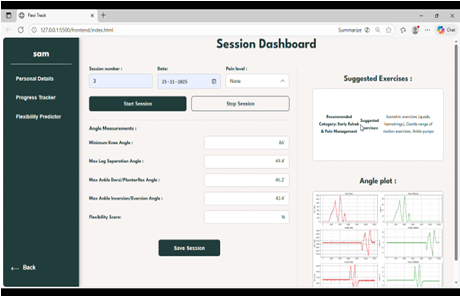

# FlexiTrack – AI-Powered Real-Time Flexibility & Movement Assessment System

## Project Overview

FlexiTrack is an AI-powered rehabilitation and movement assessment system that combines wearable sensing, computer vision, and machine learning to provide objective, real-time flexibility assessment. The system is designed for physiotherapy, rehabilitation, sports training, yoga, and home-based monitoring, enabling continuous evaluation of lower-limb flexibility and personalized exercise recommendations.

Unlike conventional flexibility assessment methods that rely on manual goniometers and subjective visual observation, FlexiTrack integrates wearable joint-angle sensors with webcam-based pose estimation to deliver accurate measurements, predictive analytics, and interactive visualization through a web dashboard.

---

## System Workflow

The FlexiTrack pipeline consists of the following stages:

1. Rotary potentiometers attached to the knee and ankle continuously measure joint movements.
2. An ESP32 microcontroller acquires, filters, and wirelessly transmits the sensor data.
3. A webcam captures lower-limb movements while MediaPipe extracts body landmarks and estimates leg separation angles.
4. Sensor measurements and computer vision outputs are combined to calculate an overall flexibility score.
5. Machine learning models generate personalized exercise recommendations and predict future flexibility progression.
6. The processed results are displayed through an interactive web dashboard for real-time monitoring and analysis.

---

## Hardware Architecture

The wearable device is built around an ESP32 microcontroller and integrates rotary potentiometers mounted on the knee and ankle to capture joint movements. Sensor readings are filtered using analog circuitry before being transmitted wirelessly for real-time processing. The hardware is enclosed in a lightweight wearable design to enable comfortable movement during flexibility assessment.

---

## Computer Vision Module

A webcam continuously captures lower-limb movements while MediaPipe detects body landmarks and estimates joint positions in real time. The extracted landmarks are used to calculate leg separation angles and complement the wearable sensor measurements, providing a hybrid movement assessment framework.

---

## Sample Assessment

FlexiTrack evaluates flexibility across different users by combining wearable sensor measurements with pose estimation. This enables objective comparison of movement patterns while supporting individualized rehabilitation and exercise planning.

---

## Machine Learning Models

The system incorporates two machine learning models developed using Scikit-learn:

### Exercise Recommendation Model

A Random Forest Classification model generates personalized rehabilitation exercises based on user-specific information such as age, medical condition, pain level, and flexibility score.

### Flexibility Prediction Model

A Random Forest Regression model predicts future flexibility improvement using historical assessment data, rehabilitation sessions, and patient-specific parameters to support long-term progress monitoring.

---

## Model Performance

The machine learning models were evaluated during development to assess prediction capability and recommendation performance. Model validation helped optimize feature selection and improve the reliability of flexibility assessment and personalized exercise recommendations.

---

## Dashboard

The interactive web dashboard provides a centralized interface for monitoring flexibility assessment results. It displays real-time joint angles, flexibility scores, personalized exercise recommendations, and progress analytics, enabling users and clinicians to track rehabilitation effectively.

---

## Features

- Real-time knee and ankle joint angle measurement
- Computer vision-based lower-limb tracking using MediaPipe
- Hybrid wearable sensor and vision-based flexibility assessment
- Automated flexibility score calculation
- Personalized exercise recommendation system
- Machine learning-based flexibility prediction
- Interactive web dashboard for visualization and monitoring
- Wireless communication using ESP32

---

## Technologies Used

### Programming Languages
- Python
- HTML
- CSS
- JavaScript

### Computer Vision
- MediaPipe
- OpenCV

### Machine Learning
- Scikit-learn
- Random Forest
- Feature Engineering
- Predictive Analytics

### Embedded Systems
- ESP32
- Arduino IDE
- UDP Communication

---

## Hardware Components

- ESP32 Microcontroller
- Rotary Potentiometers
- RC Analog Filter
- Rechargeable Lithium Battery
- Custom PCB
- 3D Printed Wearable Enclosure
- Elastic Sensor Mount

---

## Applications

- Physiotherapy
- Rehabilitation
- Sports Performance Assessment
- Home-Based Therapy
- Yoga Training
- Tele-Rehabilitation

---

## Future Scope

- Mobile application integration
- Cloud-based patient monitoring
- Multi-joint movement assessment
- Deep learning-based pose estimation
- Clinical validation with larger and more diverse datasets
